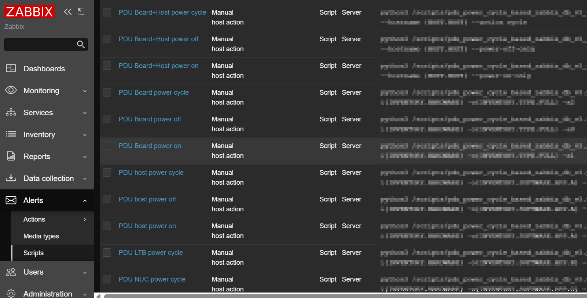

# Zabbix PDU Power Cycle Automation Suite

**The fastest way to power-cycle hundreds of lab machines concurrently**  
A Python async script that reduced regression testing time by **70%+** for **50+ engineers**.

Using the Zabbix API + smart device detection and SNMP protocol, this tool instantly identifies and executes the correct **PDU power-cycle script** on any host — whether it's a PDU Board, NUC, LTB, server, or blade — with zero manual lookup, running on fedora linux.

## Why This Exists

Before this script:

- Engineers wasted 5–15 minutes per machine finding the right PDU script
- 50+ engineers × dozens of machines daily = thousands of lost hours
- Human errors → wrong port, wrong script, bricked hardware

**After this script**:  
One command → entire rack power-cycled correctly in **under 10 seconds**

> **Real impact**: Saved **~70% of regression power-cycle time** across the entire hardware lab team.

## Key Features

- **Fully asynchronous** – executes dozens/hundreds of power cycles concurrently

- **Smart host detection** via Zabbix host metadata and model name
- Automatically selects the correct Zabbix script:
  - `PDU Board+Host power on/off/cycle`
  - `PDU Host power on/off/cycle`
  - `PDU NUC power cycle`
  - `PDU LTB power cycle`
  - etc.
- Works with **hostnames, IPs, or lists** from files
- Zero configuration needed if run by Zabbix-connected user

## Supported Devices (Auto-Detected)

Different power management devices on site.
